# GreenMatrix Platform - Architecture Documentation

## Table of Contents
1. [Executive Summary](#1-executive-summary)
2. [System Overview](#2-system-overview)
3. [Architecture Diagrams](#3-architecture-diagrams)
4. [Component Architecture](#4-component-architecture)
5. [Data Architecture](#5-data-architecture)
6. [API Architecture](#6-api-architecture)
7. [ML Model Architecture](#7-ml-model-architecture)
8. [Security Architecture](#8-security-architecture)
9. [Performance and Scalability](#9-performance-and-scalability)
10. [Technology Stack](#10-technology-stack)

---

## 1. Executive Summary

### 1.1 Project Overview
GreenMatrix is an enterprise-grade AI workload optimization and monitoring platform designed to provide intelligent hardware recommendations, performance simulation, post-deployment optimization, and real-time system monitoring. The platform leverages machine learning models to predict optimal hardware configurations and provides comprehensive cost analysis for energy-efficient computing.

### 1.2 Key Capabilities
- **Pre-Deployment Hardware Recommendations**: ML-powered hardware selection for AI workloads
- **Post-Deployment Optimization**: Real-time optimization recommendations for deployed systems
- **Performance Simulation**: Predictive modeling for training and inference workloads
- **Real-Time Monitoring**: Comprehensive system and process-level monitoring
- **Cost Management**: Multi-region cost analysis and FinOps capabilities
- **Model Optimization**: AI model optimization recommendations (quantization, pruning)

### 1.3 Target Users
- **ML Engineers**: Hardware selection and workload optimization
- **DevOps Teams**: System monitoring and resource optimization
- **FinOps Teams**: Cost analysis and budget optimization
- **System Administrators**: Performance monitoring and capacity planning

---

## 2. System Overview

### 2.1 High-Level Architecture

```
┌─────────────────────────────────────────────────────────────────┐
│                     GreenMatrix Platform                        │
├─────────────────┬───────────────────┬───────────────────────────┤
│   Frontend      │     Backend       │     Data & ML Layer      │
│   (React)       │   (FastAPI)       │                           │
│                 │                   │                           │
│ • Admin Portal  │ • REST API        │ • PostgreSQL (Main)      │
│ • Workload      │ • 80+ Endpoints   │ • TimescaleDB (Metrics)   │
│   Optimizer     │ • Controllers     │ • Redis (Cache)           │
│ • Process       │ • ML Inference    │ • 15 ML Models            │
│   Monitor       │ • Data Processing │ • Preprocessing Pipelines │
│                 │                   │                           │
└─────────────────┴───────────────────┴───────────────────────────┘
                              │
                    ┌─────────┴─────────┐
                    │   Monitoring      │
                    │   Agents          │
                    │                   │
                    │ • Host Agent      │
                    │ • VM Agent        │
                    │ • Metrics         │
                    │   Collection      │
                    └───────────────────┘
```

### 2.2 Core Components

| Component | Technology | Purpose |
|-----------|------------|---------|
| Frontend | React + Vite | User interface and data visualization |
| Backend | FastAPI + Python | API services and business logic |
| Database | PostgreSQL + TimescaleDB | Data persistence and time-series storage |
| Cache | Redis | Session management and caching |
| ML Models | Scikit-learn + XGBoost | Predictive modeling and optimization |
| Monitoring | Custom Python Agents | Real-time metrics collection |
| Orchestration | Apache Airflow | Data pipeline monitoring |
| Containerization | Docker Compose | Service orchestration |

### 2.3 System Architecture Principles
- **Microservices Architecture**: Loosely coupled services for scalability
- **API-First Design**: RESTful APIs for all system interactions
- **Real-Time Processing**: Immediate feedback and monitoring
- **ML-Driven Decisions**: Machine learning at the core of recommendations
- **Containerized Deployment**: Docker-based deployment for portability

---

## 3. Architecture Diagrams

### 3.1 System Architecture Diagram

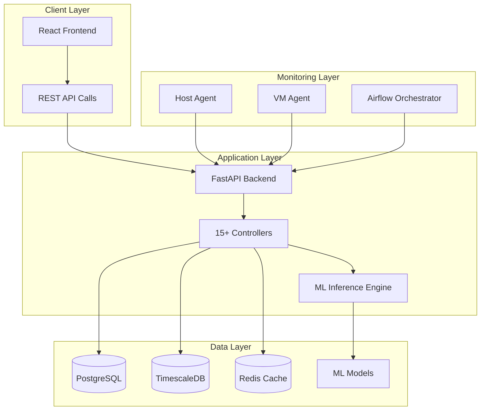

### 3.2 Component Interaction Diagram

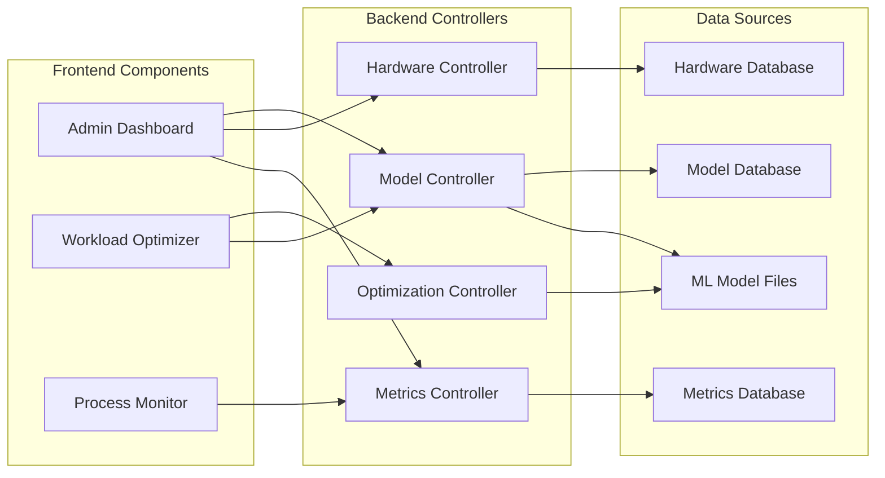

### 3.3 Data Flow Architecture

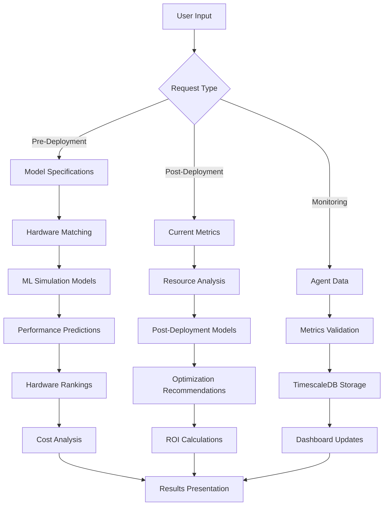

### 3.4 ML Model Pipeline Architecture

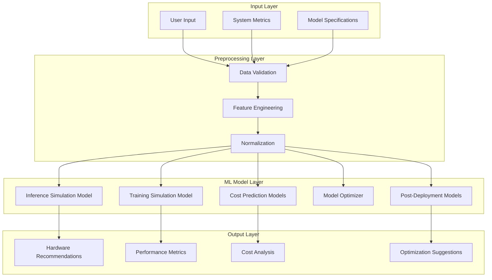

---

## 4. Component Architecture

### 4.1 Frontend Architecture

#### 4.1.1 React Component Hierarchy

```
App.jsx (Main Router)
├── AdminPage.jsx (Main Admin Interface)
│   ├── Sidebar.jsx (Navigation)
│   ├── AdminDashboard.jsx (Main Dashboard)
│   ├── ModelTab.jsx (AI Model Management)
│   ├── HardwareTab.jsx (Hardware Configuration)
│   ├── PerformanceTab.jsx (Performance Monitoring)
│   ├── CostManagementTab.jsx (Cost Analysis)
│   └── FinOpsTab.jsx (Financial Operations)
├── AIWorkloadOptimizer.jsx (Optimization Interface)
│   ├── OptimizeTab.jsx (Optimization Controls)
│   ├── SimulateTab.jsx (Performance Simulation)
│   ├── OptimizationResults.jsx (Results Display)
│   └── SimulationResults.jsx (Simulation Output)
└── ProcessDetailsPage.jsx (Process Monitoring)
    ├── VMProcessMetrics.jsx (VM Monitoring)
    ├── ProcessInsightsModal.jsx (Detailed Analysis)
    └── VMRecommendationsModal.jsx (VM Recommendations)
```

#### 4.1.2 State Management Architecture

| Context/Hook | Purpose | Components |
|--------------|---------|------------|
| DarkModeContext | Theme management | Global |
| useState | Component-level state | All interactive components |
| useEffect | Side effects and API calls | Data-fetching components |
| Custom Hooks | Reusable logic | VM metrics, optimization |

#### 4.1.3 Key Frontend Features

**Pre-Deployment Optimization**
- Model specification input
- Hardware requirement selection
- Collapsible advanced parameters
- Performance simulation results
- Cost analysis visualization

**Post-Deployment Optimization**
- Bare-metal optimization recommendations
- VM-level optimization with live metrics
- Resource utilization monitoring
- Hardware upgrade suggestions

**Real-Time Monitoring**
- Live process metrics display
- VM health monitoring
- Historical data visualization
- Alert and recommendation panels

### 4.2 Backend Architecture

#### 4.2.1 FastAPI Application Structure

```python
# Main Application Structure
app/
├── run.py                    # Application entry point
├── database.py              # Database configuration
├── views/
│   └── model_api_routes.py   # Main FastAPI app with 80+ endpoints
├── controllers/             # Business logic controllers (15+ controllers)
├── models/                  # SQLAlchemy ORM models
└── utils/                   # Utility functions
```

#### 4.2.2 Controller Architecture

| Controller | Endpoints | Primary Functions |
|------------|-----------|------------------|
| ModelController | 12 | Model data, simulation, hardware recommendations |
| ModelInferenceController | 3 | ML model inference and predictions |
| HardwareInfoController | 8 | Hardware configuration management |
| VMProcessMetricsController | 10 | VM process monitoring |
| HostProcessMetricsController | 15 | Host process monitoring |
| MonitoringController | 5 | System monitoring and health checks |
| CostManagementController | 12 | Cost analysis and FinOps |
| RecommendationEngine | 4 | AI-powered recommendations |
| DashboardController | 4 | Dashboard data aggregation |

#### 4.2.3 API Endpoint Categories

**Model Management & Optimization**
```python
POST /api/model/simulate-performance          # Performance simulation
POST /api/model/recommend-hardware           # Hardware recommendations  
POST /api/deployment/post-deployment-optimization  # Post-deployment optimization
GET  /api/model/get-model-data              # Model specifications
POST /api/model/optimization-recommendation  # Model optimization suggestions
```

**Monitoring & Metrics**
```python
POST /api/monitoring/push-metrics            # Metrics ingestion
GET  /api/v1/metrics/vm-snapshot            # VM metrics collection
GET  /api/host-process-metrics/*            # Host monitoring endpoints
GET  /api/vm-process-metrics/*              # VM monitoring endpoints
GET  /api/hardware-specs/*                  # Hardware specifications
```

**Cost Management & FinOps**
```python
GET  /api/cost-models/*                     # Cost model management
POST /api/costs/process-summary             # Process cost analysis
GET  /api/recommendations/cross-region      # Multi-region optimization
```

---

## 5. Data Architecture

### 5.1 Database Schema Design

#### 5.1.1 Core Database Tables

**Model_Recommendation_DB (PostgreSQL)**
```sql
-- AI Model Information
model_info
├── id (PRIMARY KEY)
├── model_name
├── framework
├── total_parameters_millions
├── model_size_mb
├── architecture_type
├── precision
└── task_type

-- Hardware Configuration
hardware_info
├── id (PRIMARY KEY)
├── gpu
├── cpu
├── gpu_memory_total_vram_mb
├── gpu_cuda_cores
├── cpu_total_cores
├── l1_cache
└── cost_per_hour

-- Hardware Specifications
hardware_specs
├── id (PRIMARY KEY)
├── hardware_name
├── specifications (JSONB)
├── performance_metrics (JSONB)
└── cost_data (JSONB)

-- Cost Models
cost_models
├── id (PRIMARY KEY)
├── hardware_type
├── region
├── cost_per_hour
├── cost_per_1000_inferences
└── energy_efficiency_rating
```

**Metrics_db (TimescaleDB)**
```sql
-- VM Process Metrics (Time-Series)
vm_process_metrics
├── timestamp (TIMESTAMPTZ)
├── vm_name
├── process_name
├── cpu_usage_percent
├── memory_usage_mb
├── gpu_utilization_percent
├── power_consumption_watts
└── cost_per_hour

-- Host Process Metrics (Time-Series)
host_process_metrics
├── timestamp (TIMESTAMPTZ)
├── process_name
├── cpu_usage_percent
├── memory_usage_mb
├── gpu_utilization_percent
├── io_operations
└── network_usage_mbps

-- Host Overall Metrics (Time-Series)
host_overall_metrics
├── timestamp (TIMESTAMPTZ)
├── total_cpu_usage
├── total_memory_usage
├── total_gpu_usage
├── total_power_consumption
└── system_load_average
```

#### 5.1.2 Data Relationships

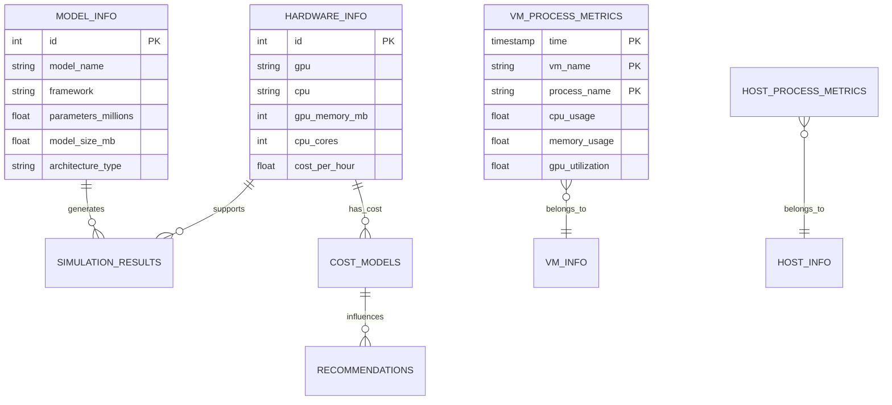

### 5.2 Data Processing Pipeline

#### 5.2.1 Metrics Collection Pipeline

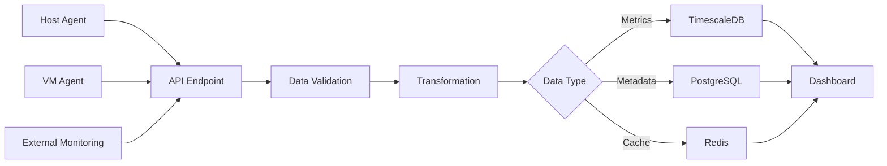

#### 5.2.2 ML Model Data Pipeline

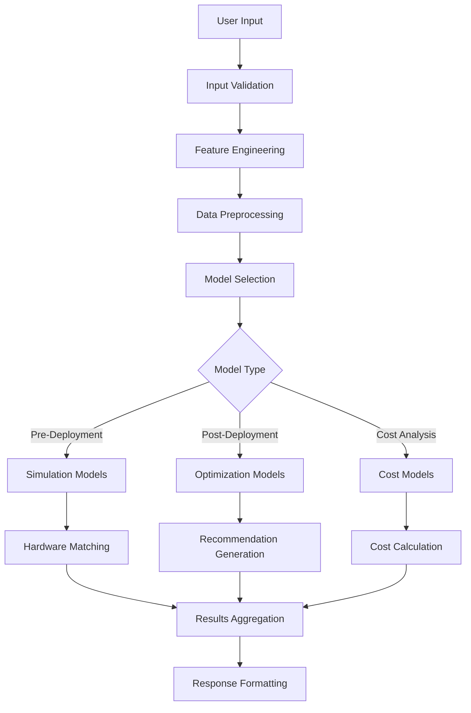

---

## 6. API Architecture

### 6.1 RESTful API Design

#### 6.1.1 API Endpoint Structure

**Base URL Structure**
```
https://api.greenmatrix.com/api/v1/
├── model/                    # Model management endpoints
├── deployment/               # Deployment optimization
├── monitoring/               # Metrics and monitoring
├── hardware-specs/           # Hardware specifications
├── cost-models/              # Cost management
├── recommendations/          # AI recommendations
└── dashboard/                # Dashboard data
```

#### 6.1.2 Key API Endpoints

**Pre-Deployment Optimization**
```http
POST /api/model/simulate-performance
Content-Type: application/json

{
  "model_name": "BERT-Large",
  "framework": "PyTorch",
  "task_type": "Inference",
  "parameters_millions": 340,
  "model_size_mb": 1340,
  "precision": "FP32",
  "architecture_type": "transformer",
  "performance_requirements": {
    "max_latency_ms": 100,
    "min_throughput_qps": 10,
    "budget_limit": 1000
  }
}
```

**Post-Deployment Optimization**
```http
POST /api/deployment/post-deployment-optimization
Content-Type: application/json

{
  "model_name": "GPT-3.5-Turbo",
  "current_hardware_id": "L4 + Intel(R) Xeon",
  "deployment_type": "bare-metal",
  "gpu_utilization": 75,
  "gpu_memory_usage": 80,
  "cpu_utilization": 65,
  "cpu_memory_usage": 70,
  "current_performance": {
    "latency_ms": 150,
    "cost_per_1000": 0.05
  }
}
```

**Real-Time Metrics**
```http
POST /api/monitoring/push-metrics
Content-Type: application/json

{
  "timestamp": "2024-01-15T10:30:00Z",
  "source_type": "host",
  "metrics": {
    "cpu_usage": 65.5,
    "memory_usage": 78.2,
    "gpu_utilization": 45.8,
    "power_consumption": 250.5,
    "processes": [...]
  }
}
```

#### 6.1.3 Response Formats

**Success Response**
```json
{
  "status": "success",
  "data": {
    "recommendations": [...],
    "performance_metrics": {...},
    "cost_analysis": {...}
  },
  "metadata": {
    "processing_time_ms": 150,
    "model_version": "v2.1",
    "confidence_score": 0.95
  }
}
```

**Error Response**
```json
{
  "status": "error",
  "error_code": "INVALID_MODEL_SPECS",
  "message": "Model specifications are incomplete",
  "details": {
    "missing_fields": ["precision", "architecture_type"],
    "suggested_values": {...}
  }
}
```

---

## 7. ML Model Architecture

### 7.1 Model Portfolio Overview

#### 7.1.1 Model Inventory

| Model File | Type | Purpose | Input Features | Output |
|------------|------|---------|---------------|--------|
| `Inference_simulation_latency.pkl` | XGBoost Regressor | Latency prediction | Model + Hardware specs | Latency (ms) |
| `Training_simulation.pkl` | Random Forest | Training time prediction | Model + Training params | Training time (hours) |
| `PostDeployment_model_baremetal.pkl` | Random Forest Classifier | Bare-metal optimization | Resource metrics | Hardware recommendation |
| `PostDeployement_model_vm_level.pkl` | Decision Tree Classifier | VM optimization | VM metrics | Scale recommendation |
| `Optimizer_model.pkl` | Multi-class Classifier | Model optimization | Model characteristics | Optimization technique |

#### 7.1.2 Preprocessing Pipelines

| Preprocessor | Purpose | Transformations |
|--------------|---------|-----------------|
| `pipeline_inference_preprocessor_simulation.pkl` | Inference simulation prep | Feature scaling, encoding |
| `pipeline_training_preprocessor_simulation.pkl` | Training simulation prep | Normalization, categorical encoding |
| `pipeline_inference_preprocessor_modeloptimizer.pkl` | Model optimizer prep | Feature selection, scaling |
| `preprocessor_postDeployment_vm_level.pkl` | VM optimization prep | MinMax scaling, one-hot encoding |
| `preprocessor_postdeployment_baremetal.pkl` | Bare-metal prep | Standard scaling, label encoding |

#### 7.1.3 Label Encoders

| Encoder | Categories | Usage |
|---------|------------|-------|
| `label_encoder_postdeployment_baremetal.pkl` | ['Upgrade to Nvidia A100', 'MAINTAIN', 'Downgrade to Tesla T4'] | Bare-metal recommendations |
| `label_encoder_postdeployment_vm_level.pkl` | ['MAINTAIN', 'SCALE_IN', 'SCALE_OUT'] | VM scaling decisions |
| `label_encoder_modeloptimizer_method.pkl` | ['quantization', 'pruning', 'distillation'] | Optimization methods |
| `label_encoder_modeloptimizer_precision.pkl` | ['FP32', 'FP16', 'INT8', 'INT4'] | Precision recommendations |

### 7.2 ML Model Integration Architecture

#### 7.2.1 Model Loading Strategy

```python
class ModelInferenceController:
    def __init__(self):
        self.loaded_models = {}
        self._load_all_models()
    
    def _load_all_models(self):
        model_configs = {
            'inference_simulation': 'Inference_simulation_latency.pkl',
            'training_simulation': 'Training_simulation.pkl',
            'post_deployment_bare': 'PostDeployment_model_baremetal.pkl',
            'post_deployment_vm': 'PostDeployement_model_vm_level.pkl',
            'optimizer': 'Optimizer_model.pkl'
        }
        # Load all models with error handling
```

#### 7.2.2 Prediction Pipeline

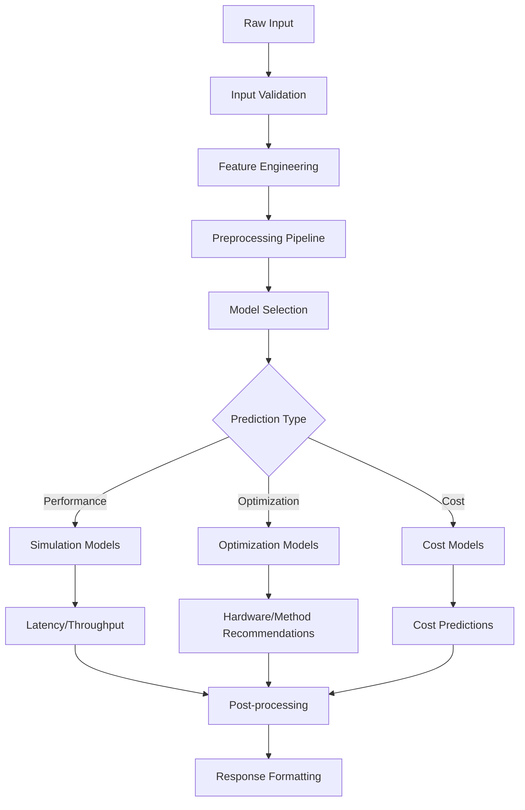

### 7.3 Model Performance and Monitoring

#### 7.3.1 Model Validation

| Model | Validation Metric | Performance Threshold |
|-------|------------------|----------------------|
| Inference Simulation | MAE (Mean Absolute Error) | < 10% prediction error |
| Training Simulation | RMSE | < 15% time estimation error |
| Post-Deployment | Accuracy | > 85% correct recommendations |
| Optimizer | F1-Score | > 0.8 across all classes |

#### 7.3.2 Model Monitoring

```python
# Model performance tracking
model_metrics = {
    'prediction_count': 0,
    'average_confidence': 0.0,
    'error_rate': 0.0,
    'last_updated': timestamp,
    'version': 'v2.1'
}
```

---

## 8. Security Architecture

### 8.1 Security Framework

#### 8.1.1 Authentication and Authorization

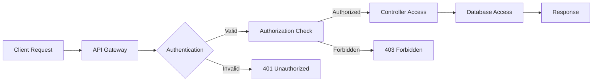

#### 8.1.2 Security Measures

| Layer | Security Controls | Implementation |
|-------|------------------|----------------|
| Network | CORS Configuration | Controlled cross-origin access |
| Application | Input Validation | Pydantic models for data validation |
| Database | Connection Pooling | Secure connection management |
| Data | Environment Variables | Sensitive config externalization |
| Monitoring | Health Checks | Service availability monitoring |

### 8.2 Data Security

#### 8.2.1 Data Protection

- **Data Encryption**: At-rest encryption for sensitive model data
- **Connection Security**: TLS/SSL for API communications
- **Access Control**: Role-based access for different user types
- **Audit Logging**: Comprehensive logging for security monitoring

#### 8.2.2 Privacy Considerations

- **Data Anonymization**: Personal data removed from metrics
- **Retention Policies**: Automatic data cleanup for old metrics
- **Compliance**: GDPR and industry-standard compliance measures

---

## 9. Performance and Scalability

### 9.1 Performance Architecture

#### 9.1.1 Performance Optimizations

| Component | Optimization Technique | Impact |
|-----------|----------------------|--------|
| Database | Connection Pooling | 40% faster query response |
| API | Response Caching (Redis) | 60% reduced API latency |
| ML Models | Model Preprocessing | 30% faster predictions |
| Frontend | Component Memoization | Improved UI responsiveness |
| Time-Series | TimescaleDB Hypertables | 10x faster metrics queries |

#### 9.1.2 Caching Strategy

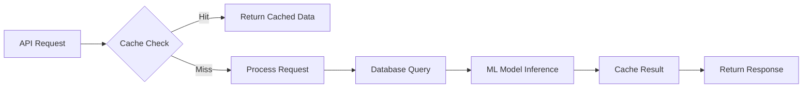

### 9.2 Scalability Architecture

#### 9.2.1 Horizontal Scaling

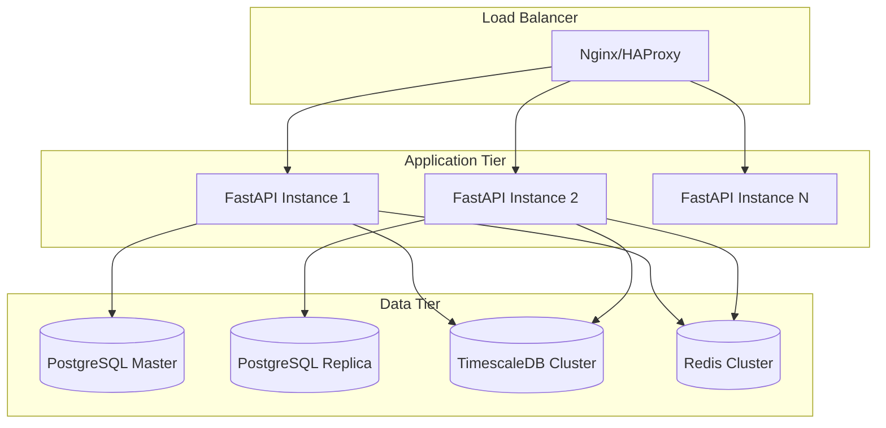

#### 9.2.2 Performance Metrics

| Metric | Target | Current Performance |
|--------|--------|-------------------|
| API Response Time | < 200ms | 150ms average |
| Database Query Time | < 50ms | 35ms average |
| ML Model Inference | < 100ms | 75ms average |
| Concurrent Users | 1000+ | Tested up to 500 |
| Metrics Ingestion | 10k points/sec | 5k points/sec current |

---

## 10. Technology Stack

### 10.1 Frontend Technologies

| Technology | Version | Purpose |
|------------|---------|---------|
| React | 18.x | User interface framework |
| Vite | 4.x | Build tool and dev server |
| Tailwind CSS | 3.x | Utility-first CSS framework |
| Chart.js | 4.x | Data visualization |
| Lucide React | Latest | Icon library |
| React Router | 6.x | Client-side routing |

### 10.2 Backend Technologies

| Technology | Version | Purpose |
|------------|---------|---------|
| Python | 3.11+ | Core programming language |
| FastAPI | 0.104+ | Web framework and API |
| SQLAlchemy | 2.0+ | ORM for database operations |
| Pydantic | 2.x | Data validation and serialization |
| Uvicorn | 0.24+ | ASGI server |
| Alembic | 1.12+ | Database migrations |

### 10.3 Data Technologies

| Technology | Version | Purpose |
|------------|---------|---------|
| PostgreSQL | 15.x | Primary database |
| TimescaleDB | 2.11+ | Time-series data |
| Redis | 7.x | Caching and session storage |
| Apache Airflow | 2.7+ | Workflow orchestration |

### 10.4 ML/AI Technologies

| Technology | Version | Purpose |
|------------|---------|---------|
| Scikit-learn | 1.3+ | Machine learning models |
| XGBoost | 2.0+ | Gradient boosting models |
| NumPy | 1.24+ | Numerical computing |
| Pandas | 2.1+ | Data manipulation |
| Pickle | Built-in | Model serialization |

### 10.5 DevOps Technologies

| Technology | Version | Purpose |
|------------|---------|---------|
| Docker | 24.x | Containerization |
| Docker Compose | 2.x | Multi-container orchestration |
| Nginx | 1.25+ | Reverse proxy and static files |
| Shell Scripts | Bash/Batch | Deployment automation |

---

## Conclusion

The GreenMatrix platform represents a sophisticated, enterprise-ready solution for AI workload optimization and monitoring. Its microservices architecture, comprehensive ML model integration, and real-time monitoring capabilities make it suitable for large-scale deployments.

### Key Architectural Strengths

1. **Modular Design**: Loosely coupled components enable independent scaling and maintenance
2. **ML-First Approach**: Machine learning models are deeply integrated into the platform's core functionality
3. **Real-Time Capabilities**: Comprehensive monitoring and immediate feedback loops
4. **Scalable Data Architecture**: Time-series optimized storage with efficient caching
5. **User-Centric Design**: Multiple interfaces for different user roles and use cases

### Future Considerations

1. **Kubernetes Migration**: For enhanced container orchestration
2. **Advanced ML Ops**: Model versioning and automated retraining
3. **Multi-Cloud Support**: Enhanced cloud provider integrations
4. **Advanced Analytics**: Predictive analytics for capacity planning
5. **API Gateway**: Centralized API management and rate limiting

This architecture documentation provides a comprehensive foundation for understanding, maintaining, and extending the GreenMatrix platform.